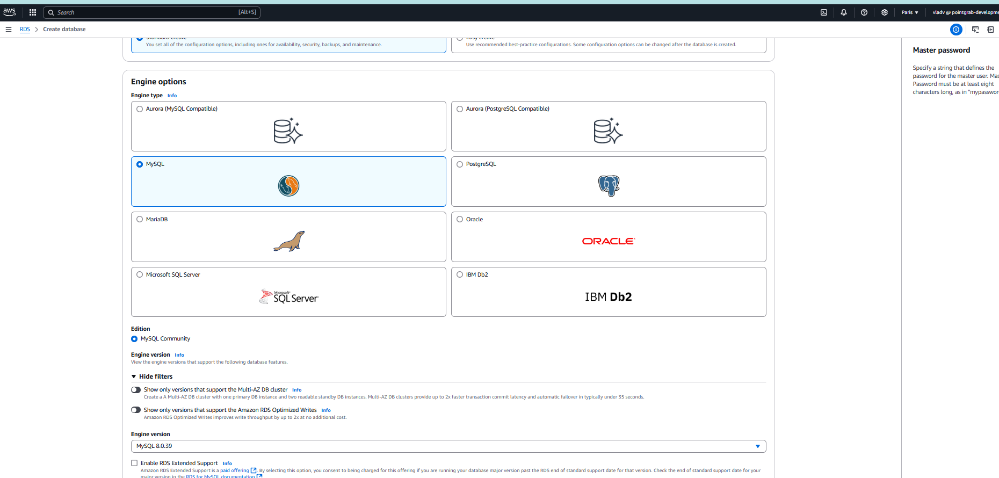
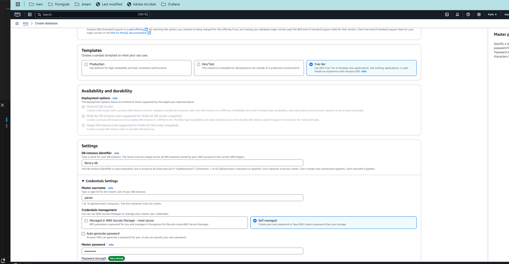
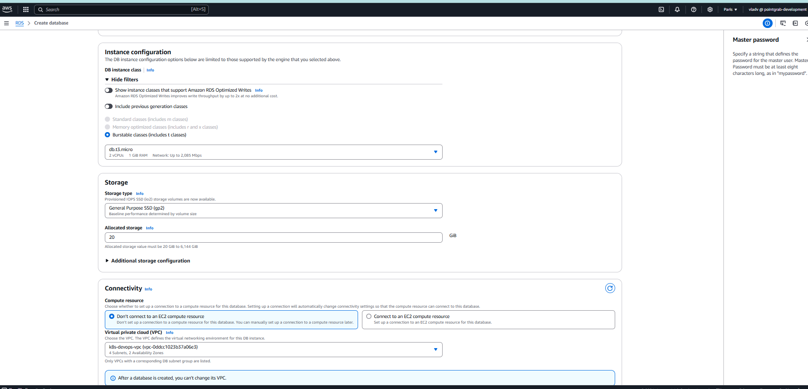
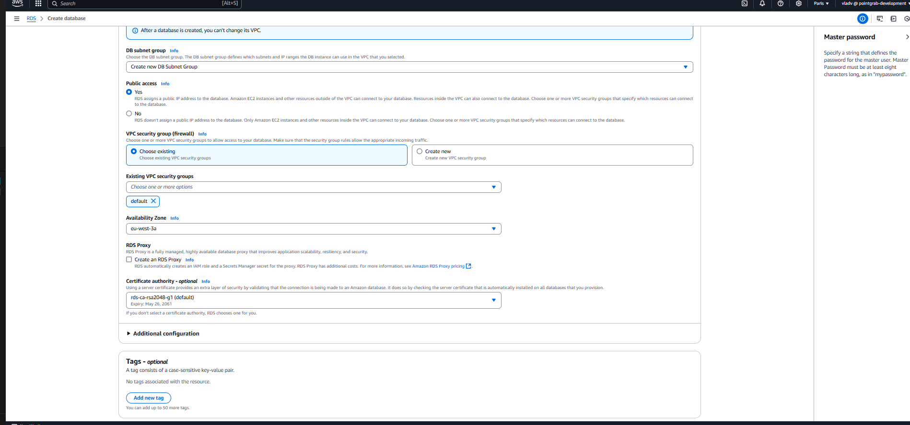
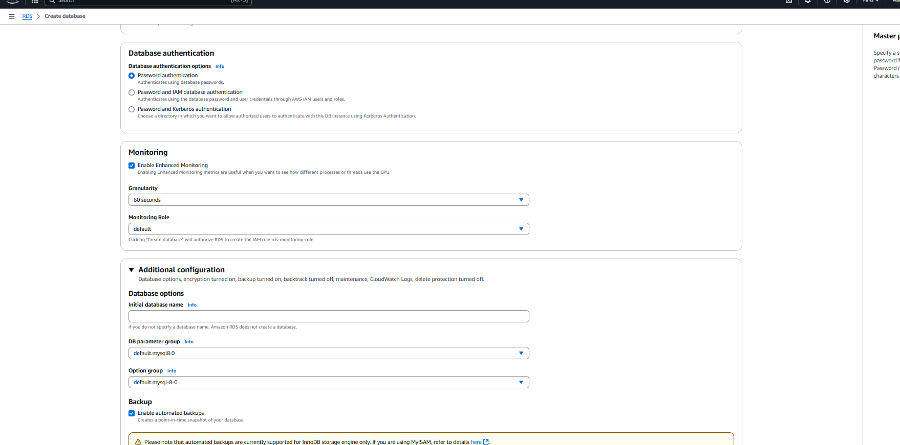
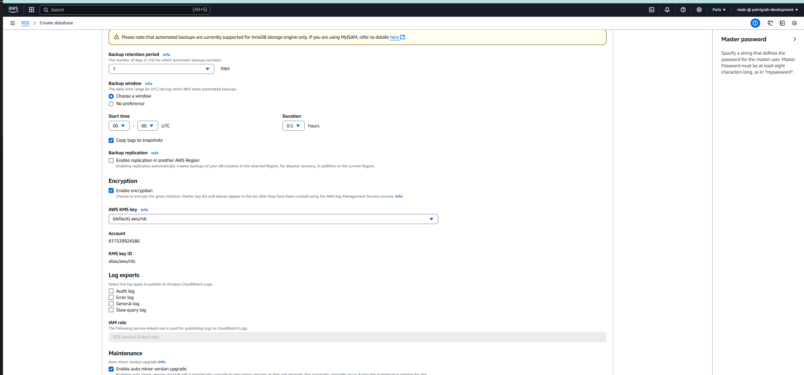
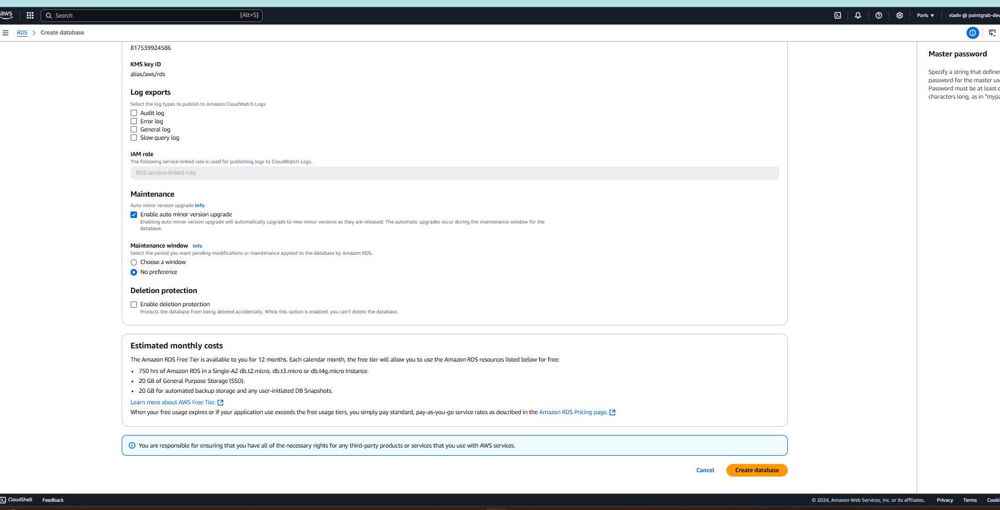
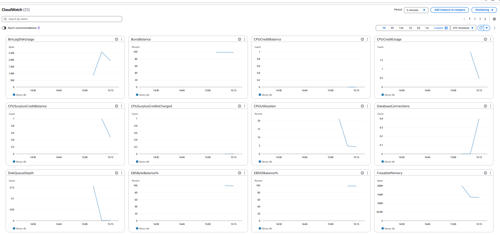

. Creating an RDS instance

1. Log in to the AWS Management Console
2. Open the RDS service and create a database instance:
* Select Create database
* Database type: MySQL (you can choose PostgreSQL if desired)
* Template: Free tier
* Configuration:
* DB instance identifier: library-db
* Master username: admin
* Master password: create a strong password
* DB instance class: db.t3.micro
* Disk space: 20 GB (General Purpose SSD)
* Enable Public access to connect to the database from your computer
* In the Network & Security section:
* Select an existing VPC or create a new one
* Add a new security group that allows access only from your IP
3. Wait for the instance creation to complete.
4. Enable automatic backup in RDS settings (Backup retention period: 7 days).

All steps above can be find in the screenshots

5. Connect to db using console

vladv@vvovk-lp:~/devops/devops-r-d/lecture-27$ mysql -h library-db.cp7dxolaiwuq.eu-west-3.rds.amazonaws.com -P 3306 -u admin -p
Enter password: 
Welcome to the MySQL monitor.  Commands end with ; or \g.
Your MySQL connection id is 28
Server version: 8.0.39 Source distribution

Copyright (c) 2000, 2024, Oracle and/or its affiliates.

Oracle is a registered trademark of Oracle Corporation and/or its
affiliates. Other names may be trademarks of their respective
owners.

Type 'help;' or '\h' for help. Type '\c' to clear the current input statement.

mysql> 

6.Create db, create 3 tables and insert data
mysql> CREATE DATABASE library;
Query OK, 1 row affected (0.07 sec)

mysql> USE library;
Database changed
mysql> CREATE TABLE authors (
    ->     id INT AUTO_INCREMENT PRIMARY KEY,
    ->     name VARCHAR(255) NOT NULL,
    ->     country VARCHAR(255)
    -> );
Query OK, 0 rows affected (0.10 sec)

mysql> CREATE TABLE books (
    ->     id INT AUTO_INCREMENT PRIMARY KEY,
    ->     title VARCHAR(255) NOT NULL,
    ->     author_id INT,
    ->     genre VARCHAR(50),
    ->     FOREIGN KEY (author_id) REFERENCES authors(id)
    -> );
Query OK, 0 rows affected (0.10 sec)

mysql> CREATE TABLE reading_status (
    ->     id INT AUTO_INCREMENT PRIMARY KEY,
    ->     book_id INT,
    ->     status ENUM('reading', 'completed', 'planned') NOT NULL,
    ->     last_updated TIMESTAMP DEFAULT CURRENT_TIMESTAMP,
    ->     FOREIGN KEY (book_id) REFERENCES books(id)
    -> );
Query OK, 0 rows affected (0.10 sec)

mysql> INSERT INTO authors (name, country) VALUES 
    -> ('George Orwell', 'United Kingdom'),
    -> ('J.K. Rowling', 'United Kingdom'),
    -> ('Haruki Murakami', 'Japan');
Query OK, 3 rows affected (0.06 sec)
Records: 3  Duplicates: 0  Warnings: 0

mysql> INSERT INTO books (title, author_id, genre) VALUES 
    -> ('1984', 1, 'Dystopian'),
    -> ('Harry Potter and the Philosopher\'s Stone', 2, 'Fantasy'),
    -> ('Kafka on the Shore', 3, 'Magical realism');
Query OK, 3 rows affected (0.06 sec)
Records: 3  Duplicates: 0  Warnings: 0

mysql> INSERT INTO reading_status (book_id, status) VALUES 
    -> (1, 'reading');
Query OK, 1 row affected (0.07 sec)

7.Make some requests:
mysql> SELECT books.title, authors.name 
    -> FROM books
    -> JOIN authors ON books.author_id = authors.id
    -> LEFT JOIN reading_status ON books.id = reading_status.book_id
    -> WHERE reading_status.status IS NULL OR reading_status.status != 'completed';
+------------------------------------------+-----------------+
| title                                    | name            |
+------------------------------------------+-----------------+
| 1984                                     | George Orwell   |
| Harry Potter and the Philosopher's Stone | J.K. Rowling    |
| Kafka on the Shore                       | Haruki Murakami |
+------------------------------------------+-----------------+
3 rows in set (0.06 sec)

mysql> SELECT COUNT(*) AS reading_books
    -> FROM reading_status
    -> WHERE status = 'reading';
+---------------+
| reading_books |
+---------------+
|             1 |
+---------------+
1 row in set (0.06 sec)

9.Create a user and provide him an access:

mysql> CREATE USER 'library_user'@'%' IDENTIFIED BY 'strong_password';
Query OK, 0 rows affected (0.07 sec)

mysql> GRANT SELECT, INSERT, UPDATE ON library.* TO 'library_user'@'%';
Query OK, 0 rows affected (0.06 sec)

mysql> FLUSH PRIVILEGES;
Query OK, 0 rows affected (0.07 sec)

10. Monitoring:
