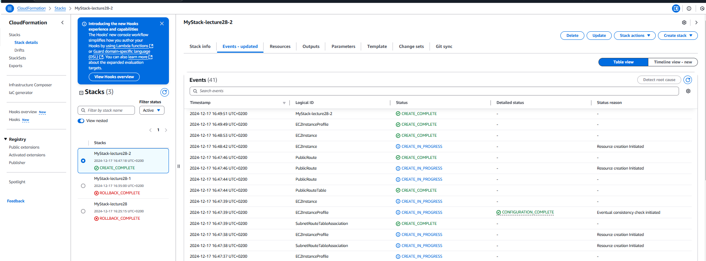
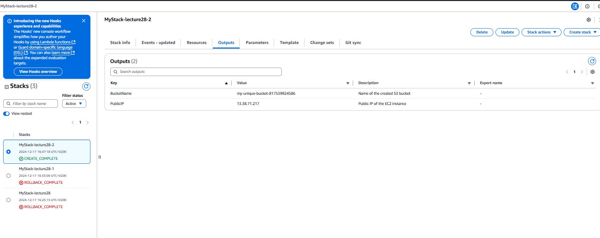
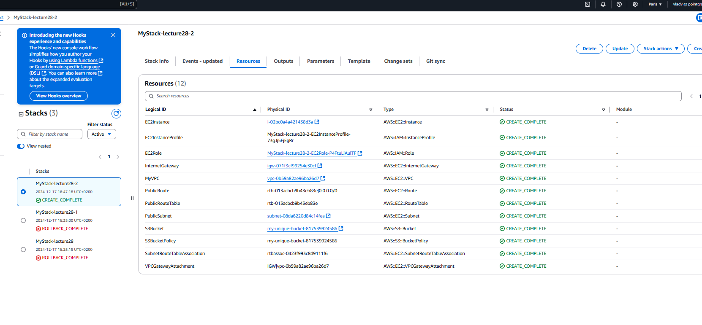

Task Description

Using CloudFormation, create an infrastructure that includes:

1. VPC – Virtual Private Network
2. EC2 Instance – Virtual Machine in the created VPC
3. IAM Role – Role to access S3 bucket
4. S3 Bucket – Private bucket to store data

📌 Task Requirements

1. VPC:
* Create a VPC with CIDR block 10.0.0.0/16.
* Add one public subnet (10.0.1.0/24) in the eu-west-3 region.
* Create an Internet Gateway for internet access.
* Configure a Route Table for the internet-facing subnet.

2. EC2 Instance:

* Use the AMI ID for Amazon Linux 2.
* Instance Type – t2.micro.
* Add an IAM Role to access S3.
* The instance must be in a public subnet.

3. IAM Role:

* Create an IAM role with the AmazonS3ReadOnlyAccess policy.

* Assign an EC2 role to the instance.

4. S3 Bucket:

* Create an S3 bucket with a unique name.

* Configure a Bucket Policy to restrict access.

* Enable versioning

5. Outputs:

* Output the Public IP of the EC2 instance.

* The name of the created S3 bucket.

cloud.yml created and infrastructure were created succesfully
you can see how mystack completed

Output

and resources:
