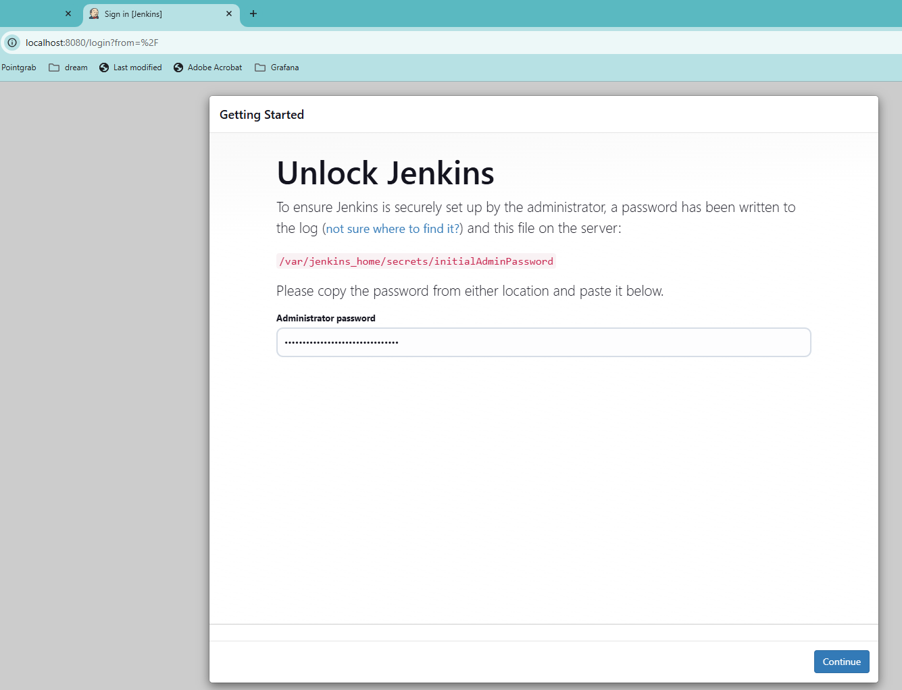
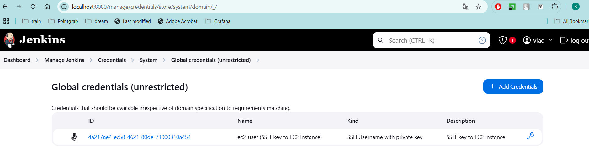
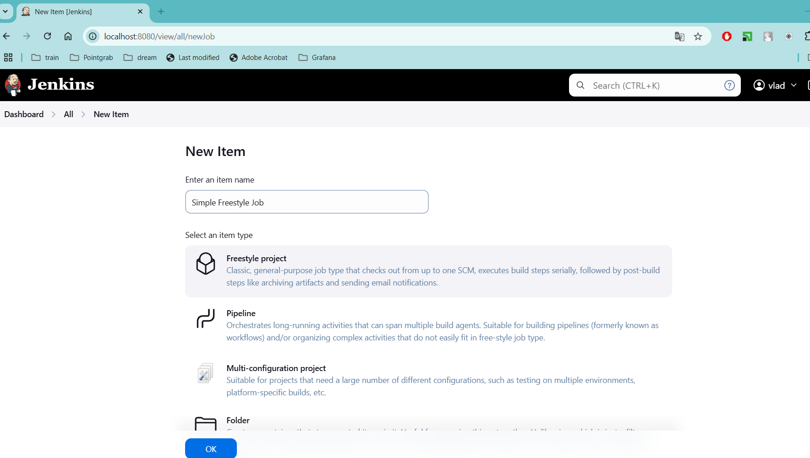

1. Fork gs-spring-boot to my github account
Click on the fork button and add it ty my account
https://github.com/volkajaizier/gs-spring-boot

2.Deploy jenkins in docker locally

docker run -d \
    --name jenkins \
    -p 8080:8080 \
    -p 50000:50000 \
    -v jenkins_home:/var/jenkins_home \
    jenkins/jenkins:lts

vladv@vvovk-lp:~/devops/devops-r-d/lecture-34$ docker ps
CONTAINER ID   IMAGE                 COMMAND                  CREATED          STATUS          PORTS                                              NAMES
c28d7db9a78d   jenkins/jenkins:lts   "/usr/bin/tini -- /u…"   35 seconds ago   Up 33 seconds   0.0.0.0:8080->8080/tcp, 0.0.0.0:50000->50000/tcp   jenkins

Get the pass for the first login

vladv@vvovk-lp:~/devops/devops-r-d/lecture-34$ docker exec jenkins cat /var/jenkins_home/secrets/initialAdminPassword
a45b72d712a64015a31a48fa3eabd511

login into jenkins with the localhost

http://localhost:8080

and use admin pass

2. Create EC2 with Amazon Linux

Update Ec2 instance and install java

sudo yum update -y
sudo amazon-linux-extras enable corretto8
sudo yum install java-1.8.0-amazon-corretto -y
java -version

[ec2-user@ip-172-31-43-31 ~]$  java -version
openjdk version "1.8.0_432"
OpenJDK Runtime Environment Corretto-8.432.06.1 (build 1.8.0_432-b06)
OpenJDK 64-Bit Server VM Corretto-8.432.06.1 (build 25.432-b06, mixed mode)

Add key in Jenkins Manage Jenkins → Credentials

Jenkins was able to connect to node
[01/22/25 14:59:41] [SSH] Starting sftp client.
[01/22/25 14:59:41] [SSH] Remote file system root /home/ec2-user/jenkins does not exist. Will try to create it...
[01/22/25 14:59:41] [SSH] Copying latest remoting.jar...
[01/22/25 14:59:44] [SSH] Copied 1,393,083 bytes.
Expanded the channel window size to 4MB
[01/22/25 14:59:44] [SSH] Starting agent process: cd "/home/ec2-user/jenkins" && java  -jar remoting.jar -workDir /home/ec2-user/jenkins -jar-cache /home/ec2-user/jenkins/remoting/jarCache
Jan 22, 2025 2:59:44 PM org.jenkinsci.remoting.engine.WorkDirManager initializeWorkDir
INFO: Using /home/ec2-user/jenkins/remoting as a remoting work directory
Jan 22, 2025 2:59:44 PM org.jenkinsci.remoting.engine.WorkDirManager setupLogging
INFO: Both error and output logs will be printed to /home/ec2-user/jenkins/remoting
<===[JENKINS REMOTING CAPACITY]===>channel started
Remoting version: 3261.v9c670a_4748a_9
Launcher: SSHLauncher
Communication Protocol: Standard in/out
This is a Unix agent
Agent successfully connected and online
The Agent is connected, disconnect it before to try to connect it again.

3. Create a Freestyle Job

4. Freestye Job Created 

it succesfully get access to  remote git 
build and build app:
Started by user vlad
Running as SYSTEM
Building remotely on jenkins-node in workspace /home/ec2-user/jenkins/workspace/Simple Freestyle Job
The recommended git tool is: NONE
using credential 8cda4fc3-4ef8-4c14-b592-32c544bf2a76
 > git rev-parse --resolve-git-dir /home/ec2-user/jenkins/workspace/Simple Freestyle Job/.git # timeout=10
Fetching changes from the remote Git repository
 > git config remote.origin.url https://github.com/volkajaizier/gs-spring-boot # timeout=10
Fetching upstream changes from https://github.com/volkajaizier/gs-spring-boot
 > git --version # timeout=10
 > git --version # 'git version 2.40.1'
using GIT_SSH to set credentials 
Verifying host key using known hosts file
 > git fetch --tags --force --progress -- https://github.com/volkajaizier/gs-spring-boot +refs/heads/*:refs/remotes/origin/* # timeout=10
 > git rev-parse refs/remotes/origin/main^{commit} # timeout=10
Checking out Revision 7d77ad35767ff76f0a8f670a2ecd532083917dcc (refs/remotes/origin/main)
 > git config core.sparsecheckout # timeout=10
 > git checkout -f 7d77ad35767ff76f0a8f670a2ecd532083917dcc # timeout=10
Commit message: "Update dependabot and Gradle files"
 > git rev-list --no-walk 7d77ad35767ff76f0a8f670a2ecd532083917dcc # timeout=10
[Simple Freestyle Job] $ mvn -f initial/pom.xml clean install
[INFO] Scanning for projects...
[INFO] 
[INFO] ------------------< com.example:spring-boot-initial >-------------------
[INFO] Building spring-boot-initial 0.0.1-SNAPSHOT
[INFO] --------------------------------[ jar ]---------------------------------
[INFO] 
[INFO] --- maven-clean-plugin:3.3.2:clean (default-clean) @ spring-boot-initial ---
[INFO] 
[INFO] --- maven-resources-plugin:3.3.1:resources (default-resources) @ spring-boot-initial ---
[INFO] skip non existing resourceDirectory /home/ec2-user/jenkins/workspace/Simple Freestyle Job/initial/src/main/resources
[INFO] skip non existing resourceDirectory /home/ec2-user/jenkins/workspace/Simple Freestyle Job/initial/src/main/resources
[INFO] 
[INFO] --- maven-compiler-plugin:3.13.0:compile (default-compile) @ spring-boot-initial ---
[INFO] Recompiling the module because of changed source code.
[INFO] Compiling 2 source files with javac [debug parameters release 17] to target/classes
[INFO] 
[INFO] --- maven-resources-plugin:3.3.1:testResources (default-testResources) @ spring-boot-initial ---
[INFO] skip non existing resourceDirectory /home/ec2-user/jenkins/workspace/Simple Freestyle Job/initial/src/test/resources
[INFO] 
[INFO] --- maven-compiler-plugin:3.13.0:testCompile (default-testCompile) @ spring-boot-initial ---
[INFO] No sources to compile
[INFO] 
[INFO] --- maven-surefire-plugin:3.2.5:test (default-test) @ spring-boot-initial ---
[INFO] No tests to run.
[INFO] 
[INFO] --- maven-jar-plugin:3.4.1:jar (default-jar) @ spring-boot-initial ---
[INFO] Building jar: /home/ec2-user/jenkins/workspace/Simple Freestyle Job/initial/target/spring-boot-initial-0.0.1-SNAPSHOT.jar
[INFO] 
[INFO] --- spring-boot-maven-plugin:3.3.0:repackage (repackage) @ spring-boot-initial ---
[INFO] Replacing main artifact /home/ec2-user/jenkins/workspace/Simple Freestyle Job/initial/target/spring-boot-initial-0.0.1-SNAPSHOT.jar with repackaged archive, adding nested dependencies in BOOT-INF/.
[INFO] The original artifact has been renamed to /home/ec2-user/jenkins/workspace/Simple Freestyle Job/initial/target/spring-boot-initial-0.0.1-SNAPSHOT.jar.original
[INFO] 
[INFO] --- maven-install-plugin:3.1.2:install (default-install) @ spring-boot-initial ---
[INFO] Installing /home/ec2-user/jenkins/workspace/Simple Freestyle Job/initial/pom.xml to /home/ec2-user/.m2/repository/com/example/spring-boot-initial/0.0.1-SNAPSHOT/spring-boot-initial-0.0.1-SNAPSHOT.pom
[INFO] Installing /home/ec2-user/jenkins/workspace/Simple Freestyle Job/initial/target/spring-boot-initial-0.0.1-SNAPSHOT.jar to /home/ec2-user/.m2/repository/com/example/spring-boot-initial/0.0.1-SNAPSHOT/spring-boot-initial-0.0.1-SNAPSHOT.jar
[INFO] ------------------------------------------------------------------------
[INFO] BUILD SUCCESS
[INFO] ------------------------------------------------------------------------
[INFO] Total time:  4.774 s
[INFO] Finished at: 2025-01-22T17:23:32Z
[INFO] ------------------------------------------------------------------------
SSH: Connecting from host [ip-172-31-34-41.eu-west-3.compute.internal]
SSH: Connecting with configuration [My-EC2-Server] ...
SSH: EXEC: completed after 200 ms
SSH: Disconnecting configuration [My-EC2-Server] ...
ERROR: Exception when publishing, exception message [Exec exit status not zero. Status [1]]
Build step 'Send build artifacts over SSH' changed build result to UNSTABLE
Finished: UNSTABLE

Unfortunately I wasn`t able to get why artifact were not able to transfer to another EC2 even so all neccesary keys was added and also connection was tested succesfu;lly from the Jenkins.

