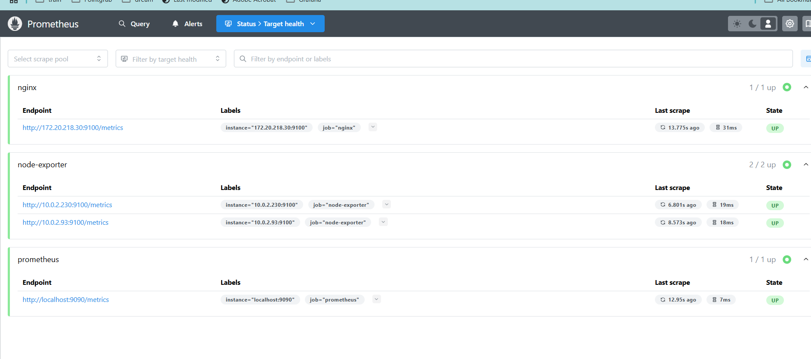
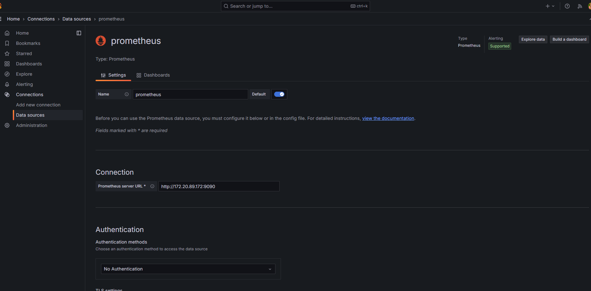
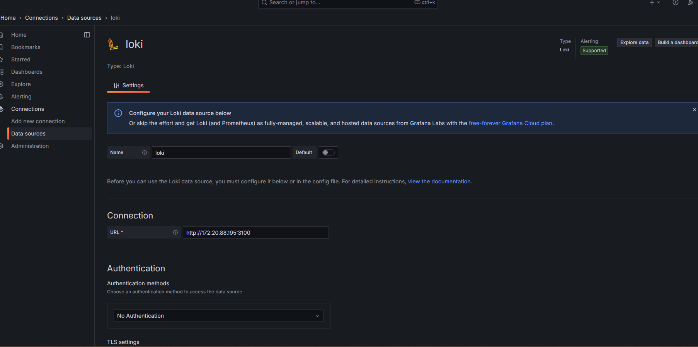
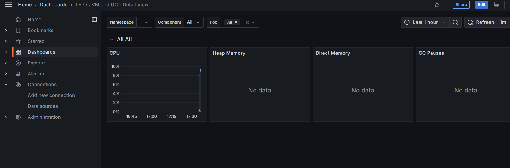

1.Created EKS cluster with terraform
2.Deploy Nginx deployment with two replica
3.Deploy storage class
4.Deploy Grafana,Prometheus and Loki.
vladv@vvovk-lp:~/devops/devops-r-d/lecture-35$ kubectl get pods -n nginx
NAME                                READY   STATUS    RESTARTS   AGE
nginx-deployment-696954bb59-jqlgj   3/3     Running   0          3h43m
nginx-deployment-696954bb59-s8jdd   3/3     Running   0          3h43m
vladv@vvovk-lp:~/devops/devops-r-d/lecture-35$ kubectl get pods -n mnitoring
No resources found in mnitoring namespace.
vladv@vvovk-lp:~/devops/devops-r-d/lecture-35$ kubectl get pods -n monitoring
NAME                                 READY   STATUS    RESTARTS   AGE
grafana-7f4d4bd55f-bcrxx             1/1     Running   0          3h42m
loki-5b4fb7bd48-7dw6v                1/1     Running   0          121m
prometheus-server-79fd47c9c9-5vdkt   1/1     Running   0          3h44m

5.Configure Prometheus

vladv@vvovk-lp:~/devops$ kubectl get svc -n nginx
NAME            TYPE           CLUSTER-IP      EXTERNAL-IP                                                              PORT(S)                                                   AGE
nginx-service   LoadBalancer   172.20.218.30   a2fa7305dc9bd42ef9756f237850e137-551438186.eu-west-3.elb.amazonaws.com   80:32284/TCP,22:31699/TCP,9100:31141/TCP,9101:32496/TCP   117m
vladv@vvovk-lp:~/devops$ kubectl get pods -o wide -n nginx
NAME                                READY   STATUS    RESTARTS   AGE    IP           NODE                                       NOMINATED NODE   READINESS GATES
nginx-deployment-696954bb59-jqlgj   3/3     Running   0          118m   10.0.2.230   ip-10-0-2-103.eu-west-3.compute.internal   <none>           <none>
nginx-deployment-696954bb59-s8jdd   3/3     Running   0          118m   10.0.2.93    ip-10-0-2-103.eu-west-3.compute.internal   <none>           <none>

6. Add prometheus as datasource and loki

7 import dashboard

go to Dashboards>import
In the Import via Grafana.com field, enter 1860 and click Load.
Select Prometheus as datasource
Click import

8.Import Nginx ingress dashboard

9. Unfortunately logs from loki I wasn`t able to configure in Grafana