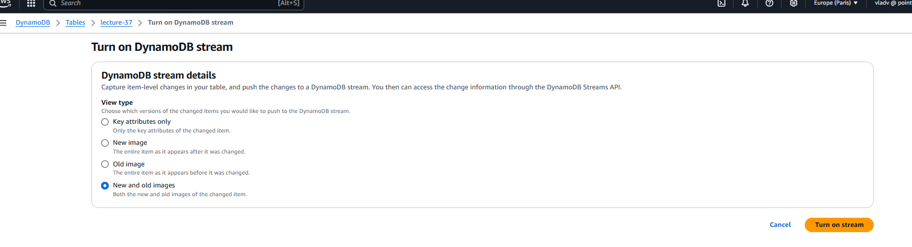
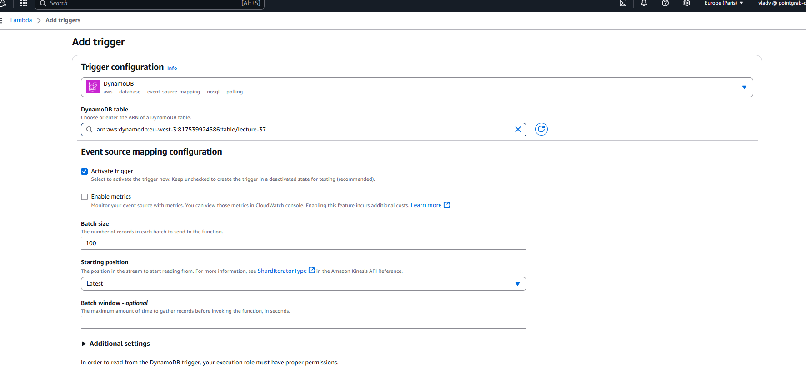
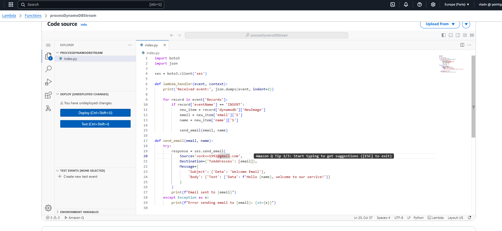
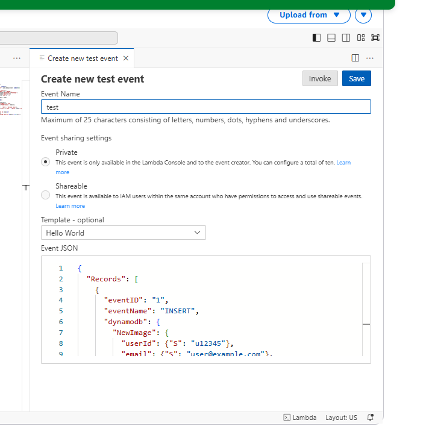
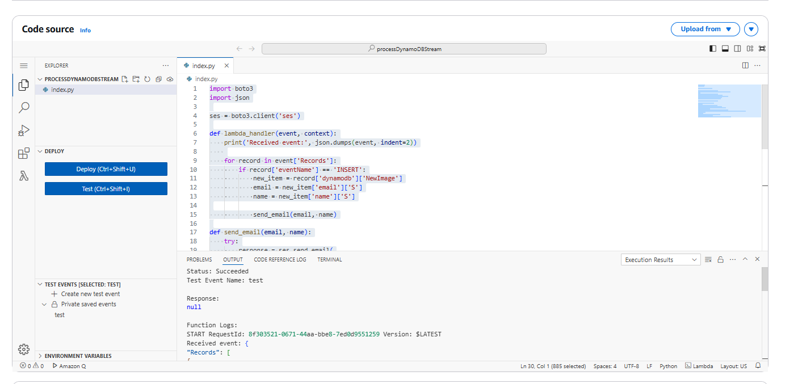
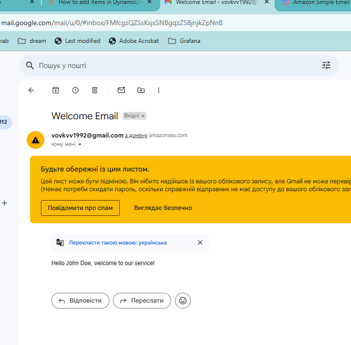

1.Create Dynamodb in AWS console
2.Add data with batch.json file and command
vladv@vvovk-lp:~/devops/devops-r-d/lecture-37$ aws dynamodb batch-write-item --request-items file://batch.json
{
    "UnprocessedItems": {}
}
vladv@vvovk-lp:~/devops/devops-r-d/lecture-37$ aws dynamodb scan --table-name lecture-37
{
    "Items": [
        {
            "phoneNumber": {
                "S": "+1-123-456-7890"
            },
            "email": {
                "S": "user@example.com"
            },
            "name": {
                "S": "John Doe"
            },
            "userId": {
                "S": "u12345"
            }
        },

2. Enable stream

3.Create Lambda function and add trigger

4. add python code 

5. deploy it and create a new test event

6. test event succeded

and mail received
